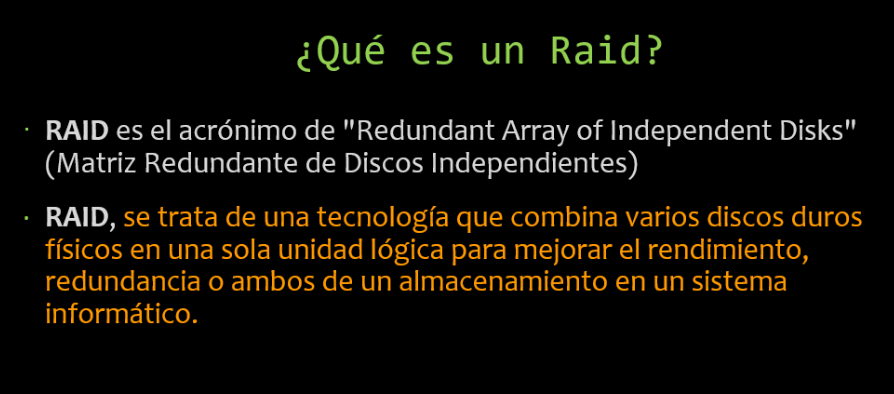
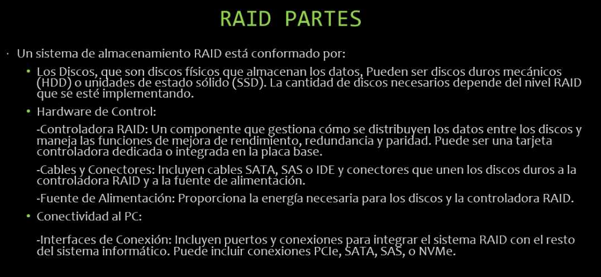
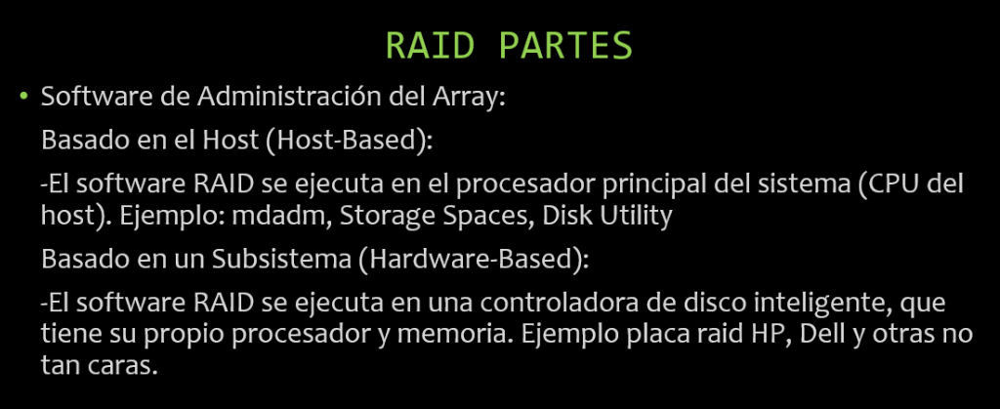
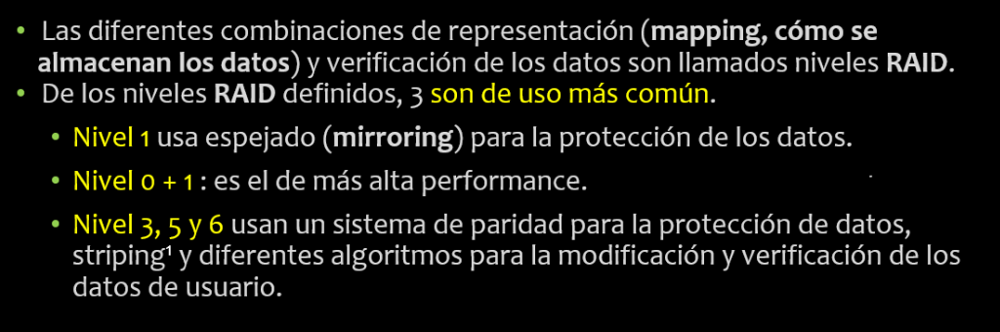
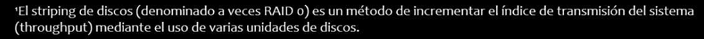
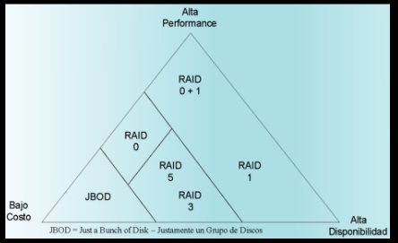
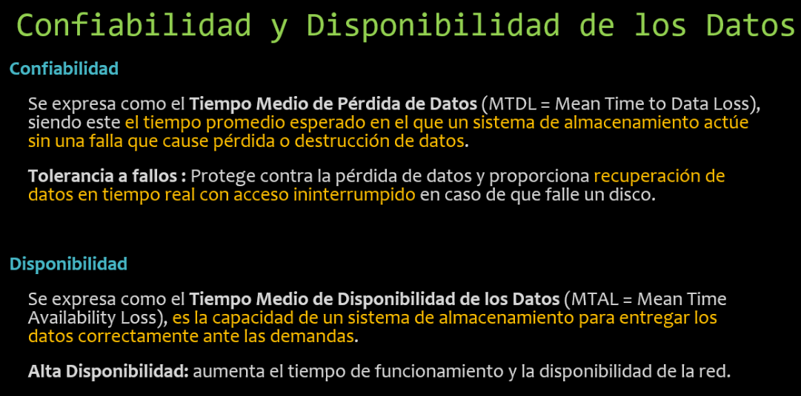

# Notas de Clase de **Sistemas Operativos | 2025**
> Profesor: Roger Asis.  
Alumno: Sebastián Alejo Markoja.  
TID material de estudio: [13.pdf](https://materiales.ies21.edu.ar/13.pdf)

## Clase 7 de Abril
Nos conectamos a un servidor hecho por el profe, iniciamos una terminal cmd o powershell y ponemos el comando:  

ssh -p 8632 usuario@190.210.55.43  

El usuario es la primera letra nombre, sumado al apellido, por ejemplo smarkoja.
La contraseña es el dni.  

Comandos que usamos:
pwd = muestra la ubicación actual
ls = listar archivos existentes o carpetas/directorios.
ls -R = para listar carpetas y ver los archivos que contienen. La R es de "recursivo".  

Vimos "direcciones absolutas" (completas que trazan todo el hilo de carpetas desde la unidad principal hasta el directorio o archivo que se busca), y "relativas" (que son más cortas, y dependen de la ubicación actual en la que se encuentra el usuario)
Ejemplo de dirección absoluta: D:\Home\Seba\Estudios\IES\semestre3\sistemas\clases\clase.txt
Ejemplo de dirección relativa: ..\sistemas\clases\clase.txt (estando ubicado inicialmente en una carpeta dentro de \semestre3 que no era \sistemas. Los dos puntos del inicio ".." significan que vuelve un nivel anterior en el esquema de carpetas.)  

la virguilla: ~ = equivale a el directorio principal del equipo, por ejemplo "/home/usuario". Se puede hacer con F8 dentro de la terminal, o con alt+126.  

cd = Es para moverse entre directorios. Significa Change Directory. Ejemplo: cd \seba. (se mueve a la carpeta seba con dirección relativa)  

man = Da info de cualquier comando, se pone al inicio y luego el comando a buscar. Ej: man mkdir
history = Muestra todos los comandos hechos.  

Apretando dos veces Tab se ven los archivos existentes cuando uno está escribiendo una dirección (abs o relativa) y no recuerda que carpetas hay.  

Al final de la sesion se recomienda salir con "exit", "logout" o ctrl+d. Es una "Graceful exit".  

## Clase 10 de Abril
Al poner el comando: ls -l  nos muestra todos los archivos del directorio e información adicional, la cual se puede leer de esta manera:

Total 20 => significa que el espacio utilizado alcanza los 20 bloques.

drwxrwxr-x 2 nuevo2 nuevo2 4096 abr  7 15:34 Actual => información del archivo
U G O
 primera d es el tipo de archivo. d = directorio,
 permisos del owner ejemplo: rwx read write execute.
 r-x = O. 
 2 = Enlaces 
 Propietario = nuevo2 
 Grupo nuevo2
 t.b 4096
 fecha abr 7 15:34 
 Actual es el archivo creado.


El - al inicio es un tipo de archivo regular, como fichero de texto. Los demás - guiones significan que no tiene ese permiso.

Si se usa touch para crear un archivo regular que ya existe, solo le modifica la fecha.

nano con el mismo archivo, entra al ya creado y permite editarlo.

less archivo1.txt nos permite visualizar el archivo pero no escribirlo.

... estos comandos llaman a aplicativos, o aplicaciones que nos dan estas funcionalidades.

El comando cat es otro aplicativo que permite incluso ver dos archivos a la vez:
Sintaxis básica:
	cat [opciones] [archivo(s)]. 
Ejemplos:
	cat archivo.txt: Muestra el contenido del archivo archivo.txt. 
	cat archivo1.txt archivo2.txt: Muestra el contenido de ambos archivos, uno después del otro. 
	cat > nuevo_archivo.txt: Permite crear un archivo y escribir contenido en él desde la terminal. 
	cat archivo.txt > nuevo_archivo.txt: Copia el contenido de archivo.txt a nuevo_archivo.txt. 
	cat archivo.txt | more: Muestra el contenido de archivo.txt paginado (útil para archivos grandes). 


cp archivo.txt archivo.txt-BKP => es para hacer backup. Esto va a copiar el mismo archivo en el directorio con la extension .txt-BKP

file => acompañado del nombre del archivo sirve para ver el tipo de archivo que es.
echo => para mostrar cosas en pantalla. echo $0 =>nos dice que interprete estamos utilizando.
 
Conceptos en Sistemas operativos
Cuando inicia el sistema operativo, se inica el SUPERVISOR.
Administradores.

System Calls - Interrupciones de sistema. Son de las interrupciones más importantes, que sirven en caso de falla.
Un intérprete transforma un código en objeto para luego poder ejecutarse.
Programa objeto.
Ensamblador o Asembler. Toma un objeto que ya ha sido compilado o programa objeto, y lo deja listo para ser ejecutable.
Cargador. Encargado de ejecutar y cargar el programa objeto procesado por el ensamblador para verlo.
A diferencia de un compilador, el intérprete lee línea por línea (sentencias).
Utilitarios:  programas que realizan tareas rutinarias y de propósitos específicos. Tales como el cp, mv, ls, etc. También desfragmentadores de disco, gestor  de cola de archivos, etc.

## Clase 14 de Abril

### Salidas Estandar  
Salida Estándar (stdout) / std out 1  //Es el flujo de salida predeterminado para la información normal y los resultados de un programa. Cuando un programa imprime algo sin especificar un destino, generalmente se dirige a la salida estándar.Por defecto, la salida estándar de un comando se muestra directamente en la ventana de la terminal.  
Entrada Estándar (stdin) / std in 0   // Aunque no es una salida, es fundamental para la interacción con los programas desde la terminal. La entrada estándar es el flujo de datos que un programa recibe. Por defecto, proviene del teclado. Los programas que esperan entrada del usuario la leen desde la entrada estándar.  
Error Estándar (stderr) / std error 2  //Está diseñado para mostrar mensajes de error, diagnósticos y otra información que indica problemas durante la ejecución de un programa. Separar los errores de la salida normal facilita la depuración y el manejo de errores en scripts.Por defecto, el error estándar también se muestra en la ventana de la terminal, mezclado con la salida estándar.  

```
ls -l 1 > fichero1.txt
```  

// el 1 está implácito. NO es necesario utilizarlo.   

Cuando se le vuelve a indicar el mismo se sobreescribe el archivo con los nuevos datos (sobreescribir accidentalmente datos, conocido como "Clobbering").
Append: concatenar cosas. Por ejemplo con:   

```
cat fichero 1
```   
Cuando se creó el archivo pesaba 0bytes, cuando se pone el comando ls -l del inicio, el valor real todavía estaba en el buffer. Luego cuando se invoca por segunda vez el comando ya aparece el dato real, pesando 912 bytes.  
```
ls -l >> redirecinSalidaEstandar.txt  
echo "El contenido del texto ...." >> RedirecionSalidaEstandar.txt  
cat RedirecionSalidaEstandar.txt  
```  
Esto ">>" imposibilita el clobbering, así no se sobreescribe el archivo.  

Se pueden combinar comandos de esta forma:  
```
cat fichero1.txt RedirecionSalidaEstandar.txt NoExiste.txt > salidaError.txt 2>&1
```  
En el contexto de la terminal de Linux (y otros sistemas Unix-like), 2>&1 es una redirección del error estándar (stderr) a la misma ubicación que la salida estándar (stdout). Vamos a desglosarlo:  

>2: Representa el descriptor de archivo asociado con el error estándar (stderr). En los sistemas Unix, a cada flujo de entrada/salida se le asigna un número de descriptor. El 0 es para la entrada estándar (stdin), el 1 para la salida estándar (stdout), y el 2 para el error estándar (stderr).  

>.>: Normalmente, este símbolo se utiliza para redirigir la salida. Cuando se usa solo con un descriptor de archivo (como 2>), redirige ese flujo a un archivo específico.  

>&1: Aquí, el & antes del 1 es importante. Indica que no se está redirigiendo al archivo llamado "1", sino que se está redirigiendo al mismo destino al que apunta el descriptor de archivo número 1 (stdout) en ese momento.  

En resumen, 2>&1 toma todo lo que normalmente se enviaría al error estándar y lo dirige al mismo lugar donde se está enviando la salida estándar.

Usamos "wc -l" como ejercicio de ejemplo de standard in. Este comando cuenta la cantidad de líneas. Como no le ingresamos ningun archivo, le escribimos a mano las frases que queramos.  

## Clase 21 de Abril

Ejercicio práctico. 

Para crear los directorios el profe propuso:
```
mkdir -p Practica/Primero Practica/Segundo
```
Sin el -p no se podría, ya que este indica que se creen los directorios padres.  

A partir del punto 5, creamos un fichero. Se puede crear de dos formas, con touch o nano. Y poner una ruta relativa o absoluta.  

Hacemos dos directorios con un archivo en cada uno. Para el segundo tenemos que mandar la salida estandar de listar. Para ello hicimos:
```
ls > Segundo/SalidaEstandar.txt
```  

Luego para modificar el archivo MiPrimerFichero.txt usamos nano, o como prefirió el profe, echo y una redirección:
```
echo Pedrito tenia un perrito chiquitito 1> MiPrimerFichero.txt
```  
luego con este comando copio el mismo contenido pero evitando el clobering o la sobreescritura (con ">>")...
```
echo Pedrito tenia un perrito chiquitito >> MiPrimerFichero.txt
``` 
## Clase 28 de Abril  
Vimos desde pág. 61. Hay que leer hasta pág 72. 

| Significado     | Letra  |
|-----------------|--------|
| Archivo regular |    -   |
| Directorio      |    d   | 
| Leer            |    r   |
| Escribir        |    w   |
| Ejecutar        |    x   |

Enlaces simbolicos (acceso directo) y enlaces duros.
Le hacemos un softlink a un fichero en nuestra carpeta.
ln -s path nombredelacceso.ln

La ruta que pongamos debe de ser Absoluta. Porque al usar este acceso directo desde otra ubicación no va a funcionar.

Los "modos" en linux son los permisos de un archivo.  

| U  |  G  | O   |
|----|-----|-----|
|rwx | +w+ | rw- |   

(Usuario (User), Grupo (Group) y Otros (Others))

```
chmod g+x Ejecutable.sh //Esto utilizó el profe para darnos permisos de Ejecución sobre el archivo 
chmod g-r Ejecutable.sh //Para SACAR permisos de lectura sobre el archivo   
```  
* Modo caracter  
chmod +  

| Significado     | Letra  |
|-----------------|--------|
| usuario propietario | u   |
| grupo|    g | 
| otros|    o   |
| agil| a   |
| igual a   | =  |
| suma  | + |
| resta | - |

* Modo Octal  

| Significado     | Letra  |
|-----------------|--------|
| Read        | 4  |
| Write       | 2  | 
| Execute     | 1  |
| Sin Permiso | 0  |  

La suma de estos nos da lo siguiente, debemos indicar uno de estos números para cada usuario (UGO):  

* 7 (4 + 2 + 1): read, write, and execute (rwx)
* 6 (4 + 2 + 0): read and write (rw-)
* 5 (4 + 0 + 1): read and execute (r-x)
* 4 (4 + 0 + 0): read only (r--)
* 3 (0 + 2 + 1): write and execute (-wx)
* 2 (0 + 2 + 0): write only (-w-)
* 1 (0 + 0 + 1): execute only (--x)
* 0 (0 + 0 + 0): no permissions (---)

grep => sirve para buscar cadenas de texto dentro de archivos
```  
ls | grep ^P
```  
Acá buscó todos los archivos que comienzan con P mayúscula. Si se cambia por s$ => todos los que terminan en s. Sin simbolos busca todas las coincidencias 'grep so'. Si agrega a todo | wc -l => cuenta la cantidad de coincidencias encontradas.  

La diferencia entre pipe y fifo es que el fifo se almacena y el otro no persiste en los archivos de sistema.

## Clase 5 de Mayo
Hoy vimos mediante el comando 
```
ipconfig /all
```
Donde en el mismo se indica datos de conexión. Muestra nuestra Dirección IPv4, Máscara de Subred (Red a la que pertenece la pc, en nuestro caso todas las del lab tienen la misma), aervidores DNS, y puerta de enlace determinada (puerto ip al que se conecta la pc).  
Luego con el comando  
```
ping 'direccion web de lo que quieras'
```
nos mostrará la latencia que existe frente a ese sitio web, TTL es el tiempo que esa ip se guardará en caché para nuevas consultas a la misma.  
### Imagen en usb para instalación de SO
Para instalar un Sistema operativo como Lubuntu, tenemos que preparar una memoria usb con Rufus, al iniciar ese programa seleccionamos la usb, formato FAT (o FAT32), y seleccionamos la imagen iso correspondiente al nuevo SO.
Vamos a "instalarlo" como sistema operativo live, quiere decir que es un sistema que podemos usar sin borrar nada del pc, y es portable mediante la usb a otros pc.    
IMPORTANTE: debemos conservar los datos de conexión de nuestra pc vistos en el ipconfig. IP, Netmask, Port, 
Luego iniciamos la pc con esta memoria y hay que apretar varias veces f8, se nos abrirá el menu de booteo, o directamente se nos puede iniciar la imagen del usb (como le paso a mariano). Luego seleccionar versión de prueba haciendo click en "try".  
Una vez iniciado el sistema y funcionando correctamente, nos dirijimos abajo a la derecha en la barra, y configuramos la conexión de red del pc, para poder acceder a internet. Agregamos una nueva red con los datos que guardamos aparte anteriormente.
Puede pasar que ya exista un perfil anterior de conexión con otros datos incorrectos, en ese caso una vez creado el nuevo, debemos hacer click izquierdo en el logo de conexiones y seleccionar nuestro nuevo perfil. De esta forma accederemos a internet.

## Clase 8 de Mayo

La diferencia entre un hosting y un servidor, es que en el hosting nos permite menos recursos, pero a un precio más económico que un servidor.
Los ínodos son un tipo de estructura de datos utilizada en **unix** donde son almacenados metadatos, los cuales son datos que describen otros datos.

> df -T //esto es parar 
> df -h//human readable
> df -ih//la i de inodo + human readable

<a id="ficheros">  Tipos de archivos </a> (son 6, administrados por *dos* sistemas distintos): 
- Sis ADM Archivos:

	* Directorios (d)

	* Ficheros Regulares/Ordinarios  (-)

	* Enlaces / Link  --> Simbólicos / Duros  (L)

	* Pipes --> | / con Nombre FiFos  (P)

	* Ficheros de bloques  (b)

- Sis ADM Dispositivos:

	* Ficheros especiales de caracteres  (c)


Ubuntu como App dentro de windows, es muy útil.  
```
ls -i => podemos ver el número de inodo de un archivo.
stat => vemos especificaciones del archivo.
```
[Wikipedia sobre Inodos](https://es.wikipedia.org/wiki/Inodo)  

Un link duro no puede tener una dirección de otro sistema de archivos.

Un **link duro** es un archivo regular (-), y es el mismo archivo que el orginal, en cambio los **links blandos** aparecen en celeste como los links y son un nuevo archivo.  
Cuando creamos un link duro hacia un fichero por ejemplo, ambos tendrán el mismo número de Inodo.  
Esto se puede ver con 'ls -il'. Entonces, es posible tener muchos nombres de archivos, con el mismo inodo.
Al crear un enlace blando con 'ln -s' no tiene el mismo inodo porque es un archivo nuevo.  
Cuando un archivo es eliminado, su **link duro** contiene aún su información, en cambio en los enlaces blandos no se pueden acceder por que el archivo base ya no existe. Una vez eliminados tanto el archivo como sus enlaces, en ese momento el inodo ya se elimina completamente.  
- Entonces para **crear** links debemos hacer:

	* Links duro = ln [ruta del enlace simbólico]

	* Link blando =  ' ln -s [ruta del archivo o directorio original] [ruta del enlace simbólico] '

## Clase 12 de Mayo
Hacemos práctica de parcial, con primera parte forms [teórico 2025](https://docs.google.com/forms/d/e/1FAIpQLSd3CcUw-RVHSNZEU0eu0mn6kpm8pUFS_5MaZKM_S12h5rU_Sg/viewform?pli=1&pli=1) (mi resultado es [este](https://docs.google.com/forms/d/e/1FAIpQLSd3CcUw-RVHSNZEU0eu0mn6kpm8pUFS_5MaZKM_S12h5rU_Sg/viewscore?pli=1&pli=1&viewscore=AE0zAgBBS5K8PDtQ_j0YHZ2OX1sJl2FpGqj9BiMQhjE00fNSBXoNSvpmELekMFo1nA)), y luego una actividad práctica en la consola (ver recursos).  
-- Para copiar un directorio con archivos y directorios podemos usar: cp -r [origen] [destino]  
## Clase 19 de Mayo | Revisión del Parcial 1
Revisamos el parcial.  
Los tipos de ficheros que existen son 5, ver [tipos de ficheros](#ficheros).  
#### Registros:
- Registro físico: Un registro físico o bloque es la unidad de información que realmente se lee o escribe de un
dispositivo.
- Un registro lógico es un conjunto de datos manejado como una unidad desde el punto de vista del
usuario

El Sistema Operativo (SO) es un conjunto variado de programas con fines diversos,
agrupados lógicamente en subsistemas, cada uno de los cuales cumple una labor determinada y específica,
supervisados por un programa que cumple la tarea de controlar la actividad de la CPU denominado
"Supervisor".

Las rutas absolutas en *Linux* siempre comienzan con la barra "/", que es el directorio raíz. Por ello por ejemplo /home/usuario es una ruta absoluta.  
La frase “el disco se encuentra fragmentado” significa... Que los clusters que componen un mismo archivo se encuentran en zonas no contiguas, lo cual
disminuye el rendimiento.  
En un echo, si se quiere hacer un "enter" o salto de línea debemos hacer echo -e "y en alguna parte pondremos esto \n para saltar de línea.".  
Al crear un Enlace Simbólico hay que siempre usar una ruta *Absoluta* para el origen del archivo al que queremos redirigir, luego en la ruta donde se guardará sí puede ser una ruta relativa.  

### Funciones del Administrador del Sistema de Archivos
(pág. 70)  
El Administrador del Sistema de Archivos implementa varias características clave para optimizar el rendimiento del acceso al sistema de almacenamiento:

* **Optimizador de búsqueda:** Minimiza los tiempos de búsqueda en disco al ordenar las escrituras y asegurar accesos múltiples a los sectores.
* **Buffer caché:** Utiliza una memoria intermedia inteligente para almacenar bloques de datos, reduciendo los accesos directos al disco. La lectura es síncrona, mientras que la escritura suele ser asíncrona para acelerar la respuesta al cliente. Se priorizan las lecturas sobre las escrituras, excepto cuando la caché está casi llena o se trata de bloques críticos del sistema de archivos (que se escriben sincrónicamente). Las aplicaciones pueden influir en el comportamiento de escritura por archivo.
* **Multiencadenado:** Permite manejar múltiples dispositivos de E/S simultáneamente, explotando el paralelismo para acceder a varios dispositivos en paralelo y atender solicitudes desde la caché mientras se realizan otras operaciones en disco.
* **Prioridad al manejador del cliente:** El Administrador puede gestionar las prioridades de los procesos que realizan solicitudes.
* **Archivos temporarios:** Para archivos de corta duración, el Administrador intenta mantener los bloques en la caché y solo los escribe a disco si es estrictamente necesario.
* **Discos de RAM:** Permite simular un disco en la memoria RAM, mejorando significativamente el rendimiento de lectura/escritura al eliminar la latencia del acceso físico. El Administrador puede omitir la caché para los discos de RAM.

## Clase 26 de Mayo
## Backups: 
Son un tipo de resguardo de información, una copia de seguridad. Son útiles frente a situaciones adversas de pérdida de discos de almacenamiento, pero no es práctico o rápido para poder seguir trabajando sobre los mismos inmediatamente.
### Tipos de Backups:
* Completo
> Contienen toda la información, todos los datos y archivos. Tardan más tiempo en realizarse, y al mismo tiempo no pueden utilizarse los recursos que se están guardando. 
* Incremental
> En este caso solo se copian los últimos archivos modificados desde el último backup. Esto ahorra tiempo y espacio. Pero su restauración puede ser más compleja ya que  deben tenerse todos los backups incrementales desde el último completo.
* Diferencial
> Se guardan todos los archivos que han sido modificados, pero siempre trabajan sobre el mismo archivo a diferencia de los incrementales que van generando un nuevo archivo de respaldo por cada cambio.  
Si tenemos un servidor de backup, debe funcionar de forma autónoma, teniendo permisos de acceso a los datos que quiere guardar. Ya que si es administrado por algo externo al mismo, si llega a ser afectado también afectará todo el backup.  

Almacenamiento online (ya conectado), offline (externo y lejano), y nearline (externo y cercano).

### Raid


La diferencia existente entre RAIDS y los Backups, es que los RAID mantienen la disponibilidad de los datos, ya que se hacen al instante luego del cambio, pueden seguir usándose, y además si un disco falla se puede seguir accediendo a los datos.  
Los backups protegen de una gran variedad de fallos que los raid no como por ejemplo errores humanos, virus, etc. 
#### Partes de un Raid



#### Niveles de RAID



#### Sistemas de almacenamiento de tipo 
* Online: Normalmente nunca pueden ser bajo costo, alta disponibilidad y alta performance de E/S al mismo tiempo.


#### Confiabilidad y disponibilidad de datos

Vemos los niveles de RAID en la presentación del profe. El raid 0 no tiene redundancia; el raid 3 es lento (lee y escribe todos los discos al mismo tiempo y se necesita un disco con datos de paridad); raid 5 tiene acceso independiente y distribuye los datos de paridad entre los discos; el raid 6 tiene una paridad doble, por ello permite continuar en caso de falla de dos discos.

## Clase 29 de Mayo - Apache2 y HTML
```
sudo apt-get update => para actualizar los paquetes de programas nada más.

sudo apt-get install apache2 => para instalar apache dos. El sudo es necesario para tener permisos.

existe "sudo apt-get upgrade" pero tarda mucho ya que actualiza absolutamte todo.

Con "sudo kill 2505" se finaliza el proceso con número PID 2505.
Con "service apache2 status" nos dda el estado actual. 
"hostname -I" para ver la IP virtual. Con esta ip accedemos al apache en la web.
sudoapt install net-tools
```

/var/www/html => acá se edita el index.html de la pagina.  

con <!-- esto es un comentario -->  
<meta charset="UTF-8"> esto se puede poner entre las etiquetas head para que admita todos los acentos.  
```
<a href="https://www.google.com">Link a google</a>  
```
con F12 se puede ver en chrome todos los elementos de la página.  
con ifconfig se puede ver la ip.  
Lo siguiente para copiar y mandar nuestro archivo index desde el ubuntu con apache a nuestro usuario en el server de la materia:  
sudo scp -P  8632 index.html nusuario@190.210.55.43:/home/nusuario/nombre.html  => y después pregunta la contraseña del usuario.

### Como compartir la página y abrir un puerto:

1. Primero en abrir nueva regla de entrada en Firewall avanzado. Creamos regla de entrada de un puerto 80.
2. Luego buscamos nuestra ip de la pc y de la maquina virtual de ubuntu.
3. Esto es para hacer un port forward (en connectaddress se pone la ip virtual del ubuntu):  
netsh interface portproxy add v4tov4 listenport=80 listenaddress=0.0.0.0 connectport=80 connectaddress=172.22.87.119
4. Y ahora se podría acceder con la ip desde cualquier dispositivo.
## Clase  3 de Junio
Diferencia entre confiabilidad y disponibilidad.
- La disponibilidad se refiere a la probabilidad de que el sistema esté andando y sea accesible cuando se lo necesita.
1. On line (inmediato, no específico en la nube sino siempre disponible).
2. Near line (Cerca de estar disponible pero con más pasos).
3. Off line o Cold line (Muchos pasos y mucha tardanza).
   
- La confiabilidad es la probabilidad del sistema de funcionar constante y sin fallas durante un tiempo determinado, y hacer perdurar los datos.

## Clase 9 de Junio

- WebMin => app web para gestión de un servidor, gratuita. Se puede hasta hacer particiones y raids desde ahí.  
- El **primer** windows que **no** era un programa de otro sistema, sino un sistema operativo hecho por Microsoft fue Windows NT.  
- Unix fue un software libre, y el abuelo de muchos sistemas (primera versión en 1969). Entre ellos Linux y macOS. Su diseño modular y eficiente, así como sus características como la multitarea y la estructura jerárquica de archivos, lo convirtieron en un estándar en la informática.  
- El Proyecto GNU de Richard Stallman, 1971, fue el proyecto para software libre.  
**No va nada de la SP3 del TID, ya que es muy vieja la info que nos da.**
**SP4 sólo toma la parte práctica que vimos en clase**
Administración de la Memoria:

## Clase 12 de Junio
Utilización de memoria RAM:  
La segmentación divide la memoria en espacios de disco que son variables.
Cuando el sistema ve que se le está acabando la memoria ram, y hay servicios que hace mucho no se utilizan, estos son movidos a una memoria virtual, generada dentro de un disco duro.  
- Memoria virtual controlada por el Sistema Operativo. Windows usa un archivo para esta memoria, mientras que Linux usa una partición de disco.  
- Memoria RAM controlada por un controlador de memoria.  

Cuando hay mucha memoria ram, no se necesita casi memoria virtual, se puede ver el disco **sin archivos de partición**.  

Jerarquía de la memoria:
1. Registros Procesador.
2. Caché CPU.
3. Memoria RAM.
4. Memoria Secundaria.  

Para crear una **Memoria virtual** (MiB Swap) siempre es preferible un SSD por sobre un HDD.  
### Hacemos práctica para el parcial:
- Los **puertos de red** se clasifican en tres categorías: puertos bien conocidos (0-1023), puertos registrados (1024-49151) y puertos dinámicos/privados (49152-65535).
- Multics es el Sistema Operativo del que derivan  FreeBSD, NetBSD, OpenBSD, macOS y la mayoría de las versiones Linux. **FALSO**
- Las tareas del Administrador de Datos son: Controlar el manipuleo de los Datos y las técnicas de archivos.
- Un intérprete de comandos fundamental en sistemas tipo Unix/Linux es: Bash.
- Backup: Los backup incrementales requieren menos espacio de almacenamiento. Y los backup diferenciales ocupan más espacio de almacenamiento a medida que aumenta el tiempo transcurrido desde la última copia de seguridad completa.
- ¿Cuál de las siguientes afirmaciones describe con mayor precisión la relación y el propósito de la RAM, la segmentación y la paginación? Explicación Detallada:
	- RAM (Memoria RAM):
		- Es la memoria volátil donde se almacenan los datos y programas que se están utilizando en el momento. Permite al procesador acceder rápidamente a la información, haciendo que el ordenador funcione de forma eficiente. 
	- Segmentación:
		- Esta técnica divide la memoria en segmentos de tamaño variable. Cada segmento puede contener diferentes partes de un programa, como código, datos o pila. El sistema operativo mantiene una tabla de segmentos que relaciona cada segmento con una ubicación física en la memoria. 
	- Paginación:
		- La paginación divide tanto la memoria lógica (el espacio de direcciones del proceso) como la memoria física (la RAM) en bloques de igual tamaño llamados páginas y marcos, respectivamente. El sistema operativo utiliza una tabla de páginas para mapear cada página lógica a su marco físico en la RAM. 
	- Relación entre Segmentación y Paginación:
		- La segmentación y la paginación pueden utilizarse en combinación. La segmentación puede crear una estructura lógica para la organización de la memoria, y luego la paginación puede facilitar la implementación eficiente de esa estructura en la memoria física. 
- ¿Cuáles son las partes constitutivas del Sistema de Procesamiento de Datos? El soporte físico, el soporte lógico y el soporte de datos.
- ¿Qué tareas realizan los Procesadores de Lenguaje? Todas las necesarias para convertir un programa en un proceso.
 
- ¿Cuál es el objetivo principal de una interrupción en un sistema operativo? Optimizar el uso del procesador.

- El Administrador de Interrupciones maneja:
	1. Interrupción por llamada al sistema.
	2. Interrupciones para la recuperación de errores.
	3. Interrupción condicional.
	4. Interrupciones de Entrada/Salida.  

- Para utilizar un Sistema Operativo Live es necesario tener un disco duro. **VERDADERO**  

[link a respuestas seba](https://docs.google.com/forms/d/e/1FAIpQLSepA5gZ_rwqSI_ebldmCBgXItbSLgWgLrO9JPbyu6A-AcZjVg/viewscore?pli=1&pli=1&viewscore=AE0zAgDjuYYKF3W-YlkwaZ_Jfxmr9NWrcF4UafF77TmRjBC2YH0gR4vaZ3petZAU_Q) 

[link a respuestas mariano](https://docs.google.com/forms/d/e/1FAIpQLSepA5gZ_rwqSI_ebldmCBgXItbSLgWgLrO9JPbyu6A-AcZjVg/viewscore?pli=1&pli=1&viewscore=AE0zAgCM059bxvGws5dxqbyzCXOxTzEA-TLX_VPN5dz5knxeczjxPamTMfw8xyDqjw) 

## Haciendo TP en el server de la materia:

> ls -r ~/Practicas2/Descomprimir/Directorio3 | grep ".conf" > ~/Practicas2/Descomprimir/Directorio1/Conf.txt
- ls: Lista el contenido del directorio.
- r: Ordena los resultados en orden alfabético inverso.
- ~/Practicas2/Descomprimir/Directorio3: Es la ruta al directorio donde están tus archivos.
- |: Este es el "pipe" (tubería). Envía la salida del comando ls (la lista de archivos) como entrada al siguiente comando, que en este caso es grep.
- grep ".conf":
- grep: Es una utilidad para buscar patrones de texto en archivos o en la entrada estándar.
- ".conf": Es el patrón que grep buscará si los nombres lo contienen.
- ">" es para guardar la salida, en Conf.txt
De esta misma manera con grep podemos filtrar por fecha, como buscar todos los registros del mes de marzo con grep " mar ".
